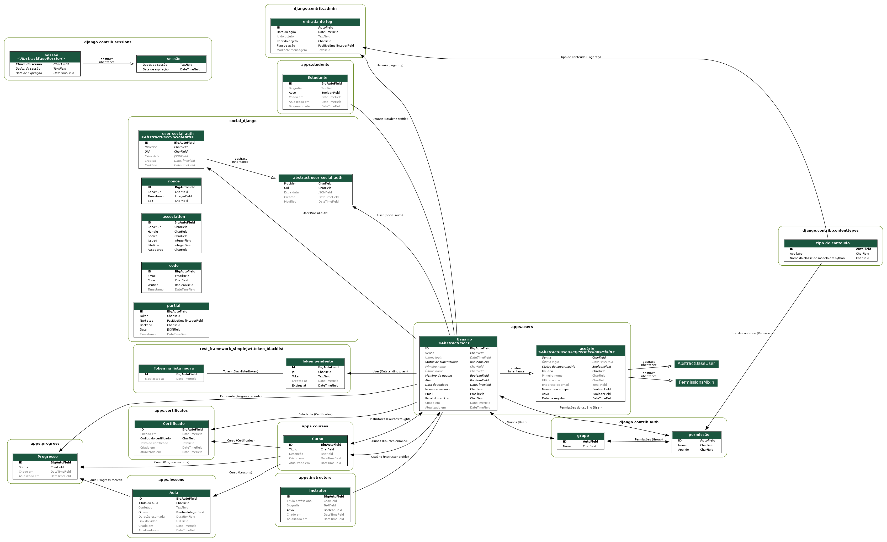
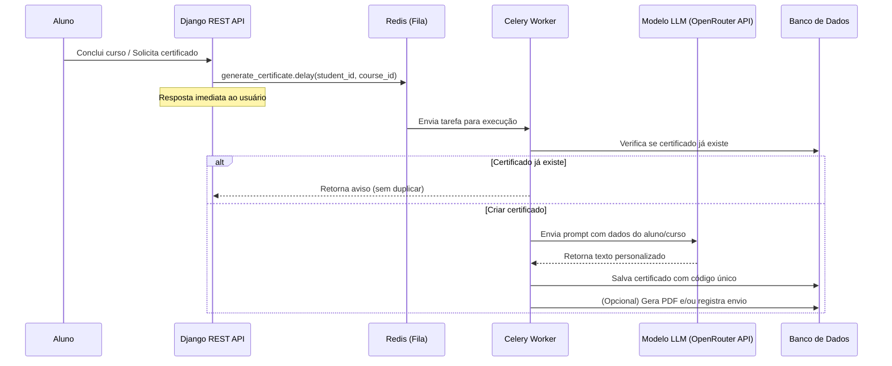

# AluConnect

AluConnect é uma plataforma educacional desenvolvida com Django REST Framework, PostgreSQL e autenticação via JWT e OAuth2. Ela conecta estudantes, instrutores e cursos em um ambiente seguro e escalável, com suporte a progresso de aprendizado, emissão de certificados e integração com login social.

## Estrutura de Pastas

```
AluConnect
├── apps
│   ├── certificates
│   │   ├── admin.py
│   │   ├── apps.py
│   │   ├── constants.py
│   │   ├── models.py
│   │   ├── serializers.py
│   │   ├── tasks.py
│   │   ├── urls.py
│   │   ├── views.py
│   │   └── tests/
│   ├── courses
│   │   ├── admin.py
│   │   ├── apps.py
│   │   ├── models.py
│   │   ├── permissions.py
│   │   ├── serializers.py
│   │   ├── urls.py
│   │   ├── views.py
│   │   └── tests/
│   ├── instructors
│   │   ├── admin.py
│   │   ├── apps.py
│   │   ├── models.py
│   │   ├── serializers.py
│   │   ├── urls.py
│   │   ├── views.py
│   │   └── tests/
│   ├── lessons
│   │   ├── admin.py
│   │   ├── apps.py
│   │   ├── models.py
│   │   ├── serializers.py
│   │   ├── urls.py
│   │   ├── views.py
│   │   ├── services/
│   │   └── tests/
│   ├── progress
│   │   ├── admin.py
│   │   ├── apps.py
│   │   ├── constants.py
│   │   ├── models.py
│   │   ├── serializers.py
│   │   ├── signals.py
│   │   ├── urls.py
│   │   ├── views.py
│   │   ├── services/
│   │   └── tests/
│   ├── students
│   │   ├── admin.py
│   │   ├── apps.py
│   │   ├── models.py
│   │   ├── serializers.py
│   │   ├── urls.py
│   │   ├── views.py
│   │   └── tests/
│   └── users
│       ├── admin.py
│       ├── apps.py
│       ├── constants.py
│       ├── models.py
│       ├── serializers.py
│       ├── urls.py
│       ├── views.py
│       └── tests/
├── config
│   ├── asgi.py
│   ├── celery.py
│   ├── __init__.py
│   ├── settings.py
│   ├── urls.py
│   ├── utils.py
│   ├── views.py
│   └── wsgi.py
├── data/
├── staticfiles/
├── manage.py
├── rundata.py
├── requirements.txt
├── pytest.ini
├── docker-compose.yml
├── Dockerfile
├── LICENSE
├── authentication_and_security.md
└── README.md
```

## Visão Geral da Arquitetura

A arquitetura do projeto foi desenhada com foco em modularidade, escalabilidade e segurança, utilizando o framework Django REST Framework para a API principal e o PostgreSQL como banco de dados relacional.  

O sistema segue o padrão clean architecture / camadas de domínio, separando responsabilidades entre autenticação, lógica de negócios e persistência de dados.  

Além disso, utiliza Redis para cache e filas assíncronas (quando necessário), e Docker Compose para orquestração local e implantação em produção.

### Estrutura Geral



#### Fluxo de Requisições

1. O cliente (frontend ou mobile) envia uma requisição HTTP (ex: login, registro, criação de certificado).
2. A API Django recebe e valida a requisição.
3. O serializer processa os dados e acessa as models.
4. A lógica de negócio executa e interage com o PostgreSQL.
5. O Redis armazena dados temporários (tokens, sessões, cache).
6. A resposta JSON é retornada ao cliente.

### Estrutura de Modelagem



## Funcionalidades

- Cadastro e autenticação de usuários com JWT e Google OAuth2
- Gestão de cursos e aulas entre estudantes e instrutores
- Registro de progresso por aula de estudantes
- Emissão de certificados ao concluir cursos
- Sistema de permissões por papel (estudante, instrutor, admin)
- Logout com blacklist de tokens
- Integração com Celery e Redis para tarefas assíncronas
- Geração automática de certificados personalizados usando modelo de linguagem (LLM), com base no nome do aluno, curso concluído e data de finalização

## Tecnologias utilizadas

- Django 5.2 + Django REST Framework
- PostgreSQL 15
- Docker + Docker Compose
- Celery + Redis
- JWT (SimpleJWT)
- Google OAuth2 (social-auth-app-django)
- Gunicorn
- Python 3.10

## Como executar o projeto

### Clone o repositório

```bash
git clone https://github.com/mariacarolinass/aluconnect.git
cd aluconnect
```

### Crie o arquivo .env

```bash
SECRET_KEY=your-secret-key
DEBUG=True
ALLOWED_HOSTS=localhost,127.0.0.1

JWT_ACCESS_LIFETIME=5
JWT_REFRESH_LIFETIME=30

GOOGLE_CLIENT_ID=key.apps.googleusercontent.com
GOOGLE_CLIENT_SECRET=your-google-client-secret

DB_ENGINE=django.db.backends.postgresql
DB_NAME=aluconnect_db
DB_USER=aluconnect_carol
DB_PASSWORD=1234
DB_HOST=db
DB_PORT=5432

OPENROUTER_API_KEY=your-openrouter-api-key

CELERY_BROKER_URL=redis://redis:6379/0
```

Caso queira utilizar SQLite ao invés de PostgreSQL, comente as variáveis relacionadas ao banco de dados PostgreSQL e adicione as linhas abaixo:

```bash
DB_ENGINE=django.db.backends.sqlite3
DB_NAME=db.sqlite3
DB_USER=
DB_PASSWORD=
DB_HOST=
DB_PORT=
```

O SQLite facilita a execução local sem a necessidade de configurar um banco de dados separado e é útil para testes rápidos ou desenvolvimento inicial sem o Docker.

### Execução e Importação de Dados com o Docker

1. Aplicar migrações

Certifique-se de que o banco de dados está atualizado antes de subir os containers:

```bash
docker-compose run --rm web python manage.py migrate
```

2. Subir os containers

Construa e inicie os containers da aplicação:

```bash
docker-compose up --build
```

#### Importando dados para o banco

O arquivo `rundata.py` importa os dados em csv do diretório `data` para o banco de dados.

3. Importar dados

Execute o script dentro do container:

```bash
docker-compose run --rm web python rundata.py
```

#### Acesse no navegador

```bash
http://localhost:8000/
```

### Execute localmente (fora do Docker)

1. Crie o ambiente virtual venv:

```bash
python3 -m venv venv
```

2. Ative o ambiente virtual

```bash
source venv/bin/activate  # Linux/macOS
venv\Scripts\activate     # Windows
```

3. Instale as dependências

```bash
pip install -r requirements.txt
```

4. Crie as migrações

```bash
python manage.py makemigrations
```

5. Aplique as migrações

```bash
python manage.py migrate
```

6. Rode a aplicação

```bash
python manage.py runserver
```

#### Acesse no navegador

```bash
http://127.0.0.1:8000/
```

#### Importar dados localmente

```bash
python rundata.py
```

## Documentação da API com Swagger

A API do AluConnect é documentada automaticamente com o pacote drf-spectacular, permitindo que qualquer pessoa visualize e teste os endpoints diretamente no navegador.

### Como acessar

Após subir o projeto, acesse:

- Swagger UI: `/api/docs/`
- Redoc: `/api/redoc/`
- Schema JSON: `/api/schema/`

### Testes com autenticação

Para testar endpoints protegidos:

1. Clique em Authorize no topo da interface Swagger

2. Insira seu token JWT no formato:

```bash
Bearer <seu_access_token>
```

3. Os endpoints protegidos estarão liberados para teste

## Como rodar os testes

### Rodando testes com Docker

```bash
docker-compose run web pytest
```

### Rodando testes localmente (fora do Docker)

Rode todos os testes com:

```bash
pytest
```

Ou rodar testes específicos:

```bash
pytest apps/users/tests/test_auth.py
```

Para visualizar a cobertura de código:

```bash
pytest --cov=apps
```

## Principais decisões de design

- JWT com refresh token e blacklist para segurança e escalabilidade
- Separação por apps (users, courses, students, progress, lessons, instructors, certificates) para modularidade
- Docker Compose com serviços isolados (web, db, redis, celery) para facilitar deploy e desenvolvimento
- Customização de erros e respostas para melhorar a experiência da API
- Uso de Celery para tarefas como envio de certificados
- Autenticação social com Google para facilitar onboarding

### Segurança

- Autenticação com JWT (JSON Web Tokens) via rest_framework_simplejwt
- Controle de acesso com permissões personalizadas (ex: IsInstructor, IsAdmin)

### Escalabilidade

O sistema foi projetado para ser facilmente escalável:

- Separação entre API, banco, cache e worker;
- Uso de containers independentes;
- Suporte a deploy em Render, AWS ECS ou Railway.

### LLM - Geração Inteligente de Certificados

- Implementação de modelos de linguagem (LLM) para gerar certificados personalizados, substituindo textos fixos por mensagens criativas, inspiradoras e contextuais.  
- O sistema utiliza a API do [OpenRouter](https://openrouter.ai) integrada via SDK oficial da OpenAI, com o modelo `mistralai/mistral-7b-instruct`, permitindo variação natural e linguagem formal nos certificados.  
- A geração é executada de forma assíncrona por meio do Celery, com o Redis atuando como *message broker*, garantindo:
  - Execução paralela e segura das tarefas;  
  - Retries automáticos em caso de falha temporária;  
  - Idempotência, evitando a criação duplicada de certificados.  
- Antes da emissão, o sistema valida o progresso do aluno, garantindo que o certificado só seja gerado após a conclusão de todas as aulas do curso.  
- O texto gerado é salvo no banco de dados junto ao código único do certificado, preservando a rastreabilidade e autenticidade do documento.

#### Arquitetura da Geração de Certificados com LLM


