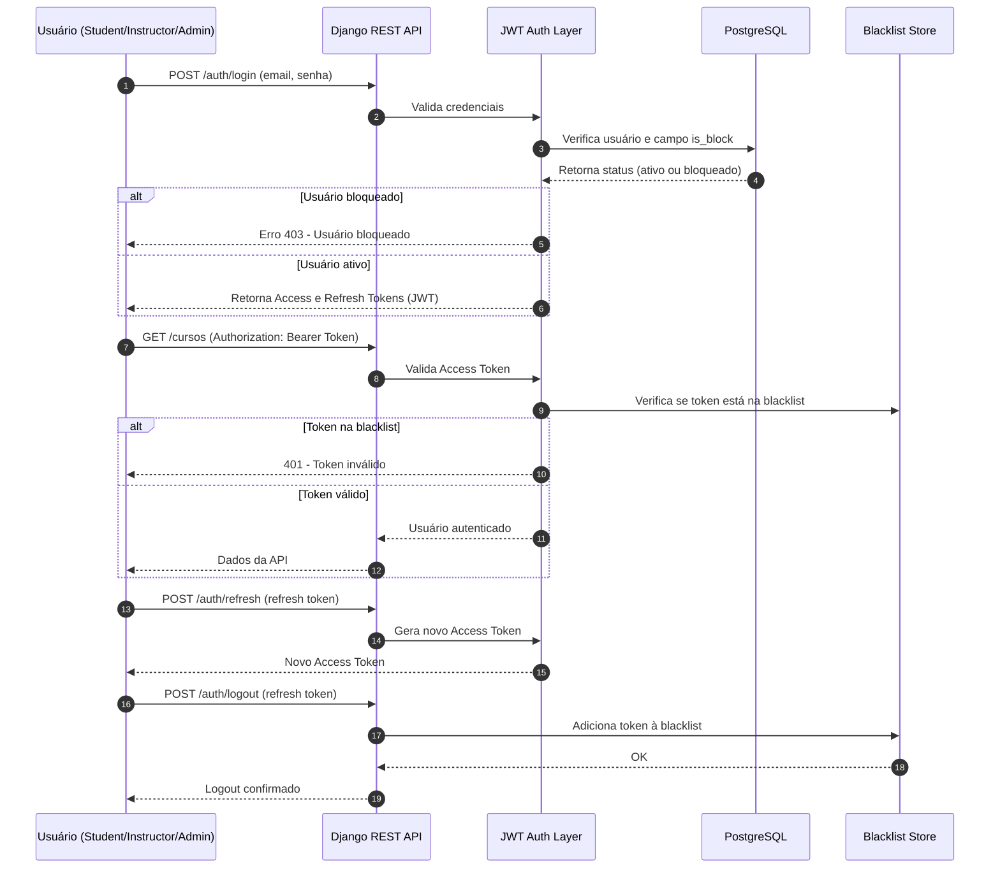

# Derivação de Requisitos

## Hipóteses Registradas e Justificativas

Durante a análise do problema e o design da solução **AluConnect**, algumas hipóteses foram registradas para guiar o desenvolvimento do sistema:

1. **Autenticação JWT é suficiente** para gerenciar sessões seguras e escaláveis sem depender de cookies ou sessões no servidor.  
   - *Justificativa:* JWT é amplamente suportado, leve e ideal para APIs RESTful distribuídas.

2. **O uso de refresh tokens** é necessário para prolongar a autenticação sem expor o token de acesso por longos períodos.  
   - *Justificativa:* o refresh permite renovar o acesso com segurança, reduzindo risco de vazamento de credenciais.

3. **Blacklist de tokens** é essencial para garantir que o logout e bloqueio de contas tenham efeito imediato.  
   - *Justificativa:* mesmo tokens ainda válidos podem ser inutilizados quando colocados na lista negra.

4. **Flag `is_block` para usuários (Student)** foi adicionada para suspender temporariamente acessos sem excluir a conta.  
   - *Justificativa:* promove flexibilidade administrativa e mantém a integridade dos dados históricos.

5. **Diferenciação de papéis e permissões** usuários devem ter diferentes níveis de acesso conforme o papel desempenhado (estudante, instrutor ou administrador).
   - *Justificativa:* O campo role no modelo User define o tipo de usuário e permite aplicar restrições específicas, utilizando classes de permissão personalizadas como IsInstructor. Por exemplo, apenas instrutores podem criar aulas ou emitir certificados, enquanto administradores gerenciam usuários e permissões. Essa hierarquia de papéis garante o princípio do menor privilégio e melhora a segurança e a organização das funcionalidades dentro da plataforma.

## Síntese

As hipóteses levantadas permitiram derivar os seguintes requisitos do AluConnect:

**Requisitos Funcionais**

- **RF01**: O sistema deve autenticar usuários por meio de JWT.
- **RF02**: O sistema deve permitir renovação de tokens via refresh token.
- **RF03**: O sistema deve possibilitar o bloqueio temporário de estudantes.
- **RF04**: O sistema deve invalidar tokens por meio de blacklist.
- **RF05**: O sistema deve gerenciar papéis distintos (Student, Instructor, Admin).

**Requisitos Não Funcionais**

- **RNF01**: A autenticação deve seguir o modelo stateless e ser compatível com APIs REST.
- **RNF02**: O controle de acesso deve respeitar o princípio do menor privilégio.
- **RNF03**: O sistema deve garantir rastreabilidade e segurança nas operações de autenticação.

## Diagrama — Fluxo de Autenticação JWT e Controle de Acesso

## Destaques Técnicos

- **Access Token:** curto prazo (~10 min), autoriza requisições comuns.
- **Refresh Token:** longo prazo (~7 dias), usado para renovar sessões.
- **Redis Blacklist:** invalida tokens antes da expiração.
- **Flag is_block:** bloqueia usuários sem excluir conta.
- **Segurança:** fluxo compatível com OAuth2 e JWT, seguindo boas práticas RESTful.

## Documentação com Swagger

A API está documentada com Swagger (via drf-spectacular), permitindo que desenvolvedores explorem endpoints autenticados e públicos de forma interativa.

Isso facilita o teste dos fluxos de autenticação JWT e a visualização dos esquemas de requisição e resposta diretamente no navegador.
